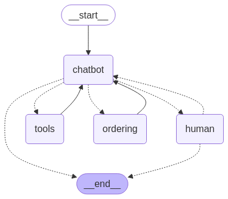

# YummyBot

This is a repository of an AI Agent - YummyBot built upon Google's Gemini model.

Yummy bot is a food ordering Ai Agents that assists with collecting customes' orders, and sending them to the kitchedn for the food to be served.

YummyBot is still a work in progress and will be updated periodically.

Here is a picture of the Order of actions of the YummyBot Agent

